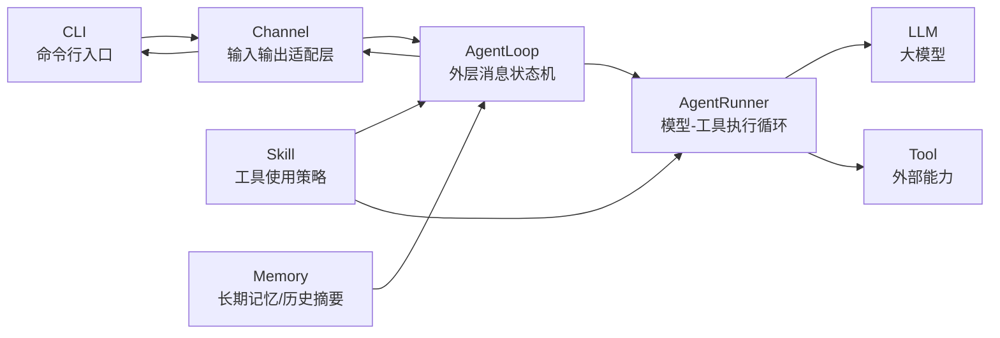

# clawbot 基座实现汇报文字稿

---

## Slide 1: 这一部分讲什么

这一部分先不讲 paper 业务包，而是讲底层的 clawbot 基座。

clawbot 基座解决的是一个通用问题：如何把一个大模型包装成可以持续对话、可以调用工具、可以维护上下文、也可以接入不同输入输出渠道的 Agent 框架。

我会按六个模块讲：

1. Channel：连接 Agent 和输入输出源。
2. Tool：把外部能力包装成模型可调用的工具。
3. Skill：把工具使用策略写成可注入的指令。
4. Memory：维护长期记忆和历史压缩。
5. AgentLoop：处理一条用户消息的外层生命周期。
6. AgentRunner：处理模型和工具之间的内层循环。

---

## Slide 2: 项目宏观架构

### PPT展示文字

clawbot 基座把一个对话式 Agent 拆成七个核心模块：

- `CLI`：本地命令行入口，负责接收用户输入和展示回复。
- `Channel`：统一输入输出协议，屏蔽 CLI、飞书、Web 等不同来源。
- `AgentLoop`：一轮消息的外层状态机，负责 session、命令、上下文构建、保存和回复。
- `AgentRunner`：模型与工具之间的内层循环，负责 LLM 调用和 tool call 执行。
- `Tool`：可被模型调用的外部能力，例如搜索、读文件、写笔记。
- `Skill`：告诉模型如何组合工具完成任务的行为说明。
- `Memory`：提供长期记忆、用户画像和历史摘要。

一句话概括：

```text
CLI / Channel 负责接入，AgentLoop 负责编排，AgentRunner 负责执行，Tool / Skill / Memory 提供能力和上下文。
```

### 图片生成说明

请生成一张简洁的系统架构图，适合放在 PPT 中。

图中包含 7 个模块：`CLI`、`Channel`、`AgentLoop`、`AgentRunner`、`Tool`、`Skill`、`Memory`。

推荐布局：



视觉要求：

- 使用横向架构图，从左到右展示消息流。
- `CLI` 和 `Channel` 放在左侧，表示输入输出边界。
- `AgentLoop` 放在中间偏左，作为外层编排核心。
- `AgentRunner` 放在中间偏右，连接 `LLM` 和 `Tool`。
- `Skill`、`Memory` 放在上方或下方，作为上下文/策略输入连接到 Agent 层。
- 风格简洁、技术感、适合课堂汇报；不要使用复杂背景。

---

## Slide 3: Channel 模块

### PPT展示文字

Channel 模块负责连接 Agent 和外部输入输出源。

Agent 只消费 Channel 中的用户消息；生成回复后，也统一发回 Channel。

如果要接入新的消息来源，例如飞书或 Web，只需要实现同一个 Channel 接口：


```ts
interface Channel {
  name: string;
  start(): Promise<void>;
  stop(): Promise<void>;
  send(msg: OutboundMessage): Promise<void>;
  onMessage(handler: InboundHandler): void;
}
```

核心思想：

```text
不同输入输出源 -> Channel -> Agent -> Channel -> 不同输入输出源
```

### 图片生成说明

请生成一张简单的适配器模式示意图。

图中左侧是多个输入输出源：`CLI`、`Feishu`、`Web`。

中间是统一的 `Channel Interface`。

右侧是 `AgentLoop`。

箭头表达：

```text
CLI / Feishu / Web -> Channel Interface -> AgentLoop
AgentLoop -> Channel Interface -> CLI / Feishu / Web
```

重点突出：新增一种输入输出源时，只需要新增一个 Channel 实现，不需要修改 AgentLoop。

---

## Slide 4: Tool 模块

### PPT展示文字

Tool 模块把外部能力包装成模型可以调用的函数。

一个 Tool 主要包含：

```ts
interface Tool {
  name: string;
  description: string;
  parameters: JsonSchema;
  readOnly?: boolean;
  concurrencySafe?: boolean;
  confirmation?: {...};
  execute(args, ctx): Promise<ToolResult>;
}
```

`ToolRegistry` 负责统一管理工具：

- `register()`：注册工具。
- `getToolDefs()`：生成传给 LLM 的工具 schema。
- `prepareCall()`：解析并校验模型传来的参数。
- `execute()`：执行工具，并统一包装结果。
- `scope()`：给 sub-agent 派生受限工具集。

模型不会直接执行代码。它只产生 tool call，真正的参数校验、错误处理和函数执行都由 ToolRegistry 完成。

核心作用：

```text
Tool = LLM 和外部能力之间的安全边界
```

### 图片生成说明

请生成一张 Tool 调用链路图，适合放在 PPT 中。

图中包含这些节点：

- `LLM`
- `tool call`
- `ToolRegistry`
- `参数解析 / 参数校验 / 错误包装`
- `具体 Tool`
- `ToolResult`
- `LLM final response`

推荐流程：

```text
LLM -> tool call -> ToolRegistry -> 参数解析与校验 -> 具体 Tool -> ToolResult -> LLM -> final response
```

视觉重点：

- `ToolRegistry` 放在中间，作为工具调用的统一入口。
- `具体 Tool` 可以画成一组小卡片，例如 `paper_search`、`read_paper`、`read_note`。
- 强调 ToolResult 会回到 LLM，而不是直接展示给用户。

---

## Slide 5: Skill 模块

Tool 只告诉模型“能调用什么函数”，但 Skill 告诉模型“什么时候调用、怎么组合这些工具”。

clawbot 的 Skill 是 Markdown 文件，通常叫 `SKILL.md`。它可以带一些元信息，例如：

```text
description: paper search workflow
always: true

这里写具体的使用策略和流程说明。
```

`SkillsLoader` 会扫描 workspace skills 和 builtin skills：

1. workspace skill 可以覆盖 builtin skill。
2. disabled skill 会被隐藏。
3. `always: true` 的 skill 会自动注入 system prompt。
4. 其他 skill 会出现在可用 skill 摘要里。

所以 Skill 本质上不是可执行代码，而是可配置、可扩展的 Agent 行为说明。

---

## Slide 6: Tool 和 Skill 如何进入模型上下文

Tool 和 Skill 都会影响模型决策，但进入模型的方式不完全一样。

Tool 有两层入口：

1. `ContextBuilder` 会把工具列表渲染进 system prompt，给模型一个可读的工具说明。
2. `AgentRunner` 在请求 LLM 时会传入 `tools.getToolDefs()`，这是模型真正产生 tool call 所依赖的 schema。

Skill 主要通过 `ContextBuilder` 进入 system prompt：

1. `always: true` 的 skill 会作为 Active Skills 完整注入。
2. 其他 skill 会作为 Available Skills 摘要出现。

所以可以这样理解：

```text
Tool = prompt 中的说明 + LLM API tools schema
Skill = prompt 中的行为策略和工具组合方法
```

---

## Slide 7: Memory 机制

### PPT展示文字

Memory 模块解决的是上下文长期化问题。

它不是只保存一份聊天记录，而是分成三层机制：

1. **Session 原始上下文 + Summary**
   - Session 保存当前会话的逐轮 turn。
   - 当上下文过长时，旧 turn 会被压缩成 session summary。
   - 后续对话只回放最近 turn，并把 summary 注入 prompt。

2. **跨 Session History**
   - 被压缩或归档的内容会写入 history。
   - history 记录跨会话的历史材料，避免旧 session 信息完全丢失。

3. **Dream**
   - Dream 定期读取未处理的 history。
   - 进一步提炼长期记忆，写入 `MEMORY.md`、`USER.md`、`SOUL.md`。
   - 这些长期记忆会作为 context block 注入后续 prompt。

核心路径：

```text
Session turns -> Summary -> History -> Dream -> Long-term Memory
```

### 图片生成说明

请生成一张 Memory 分层机制图，适合放在 PPT 中。

图中从左到右展示三层：

```text
Session 原始上下文
  -> AutoCompact / Consolidator
  -> Session Summary + History
  -> Dream
  -> Long-term Memory
  -> Prompt Context
```

节点说明：

- `Session turns`：当前会话原始消息，包括 user / assistant / tool turns。
- `Session Summary`：压缩后的当前会话摘要，用于继续当前 session。
- `History`：跨 session 的历史归档。
- `Dream`：把 history 提炼为长期记忆。
- `MEMORY.md / USER.md / SOUL.md`：最终长期记忆文件。
- `Prompt Context`：长期记忆重新进入模型上下文。

视觉重点：

- 用三层颜色区分：短期上下文、跨会话历史、长期记忆。
- 用箭头表示信息逐步压缩和沉淀。
- 强调 Memory 不是单一文件，而是一条“压缩、归档、提炼、再注入”的链路。

---

## Slide 8: AgentLoop 状态机

### PPT展示文字

AgentLoop 是一轮用户消息的外层状态机。

它使用显式 transition table 驱动状态转移：

```text
RESTORE -> COMPACT -> COMMAND -> BUILD -> RUN -> SAVE -> RESPOND -> DONE
```

关键状态：

- `RESTORE`：加载 session，并先保存用户消息。
- `COMMAND`：处理 slash command；命中时走 shortcut，不进入 LLM。
- `BUILD`：构造 system prompt 和历史消息。
- `RUN`：调用 AgentRunner，执行模型与工具循环。
- `SAVE`：保存本轮产生的新 turns 和 usage。
- `RESPOND`：把最终回复发回 Channel。

核心价值：

```text
状态转移显式化，让一轮消息的生命周期可追踪、可测试、可恢复。
```

### 图片生成说明

请生成一张 AgentLoop 状态机流程图。

主流程：

```text
RESTORE -> COMPACT -> COMMAND -> BUILD -> RUN -> SAVE -> RESPOND -> DONE
```

特殊分支：

```text
COMMAND -- shortcut --> DONE
```

每个状态画成一个圆角矩形，箭头上标注 event：

- `RESTORE -- ok --> COMPACT`
- `COMPACT -- ok --> COMMAND`
- `COMMAND -- dispatch --> BUILD`
- `COMMAND -- shortcut --> DONE`
- `BUILD -- ok --> RUN`
- `RUN -- ok --> SAVE`
- `SAVE -- ok --> RESPOND`
- `RESPOND -- ok --> DONE`

视觉重点：

- `COMMAND -- shortcut --> DONE` 用不同颜色表示命令短路路径。
- `RUN` 状态旁边标注“AgentRunner / LLM + Tools”。
- 整体风格简洁，突出“显式状态机”和“事件驱动转移”。

---

## Slide 9: AgentRunner 的 ReAct 循环

### PPT展示文字

AgentRunner 是真正执行 ReAct 循环的地方。

它不处理 Channel、slash command 或 session 持久化，只负责一件事：

```text
给定 system prompt、历史 messages 和 tools，一直运行到模型不再调用工具为止。
```

一次循环可以理解成四步：

1. **Reason**
   - Runner 把 system prompt、messages 和 tool schema 传给 LLM。
   - 模型根据当前上下文决定：直接回答，还是先调用工具。

2. **Act**
   - 如果模型返回 `tool_calls`，Runner 会先记录这条 assistant turn。
   - 再通过 `ToolRegistry` 解析参数、校验权限、执行具体工具。

3. **Observe**
   - 每个 `ToolResult` 会被转成 `role=tool` 的 message。
   - 这些 observation 会追加回本次 Runner 的 messages，供下一轮 LLM 继续推理。

4. **Finish**
   - 如果某一轮模型没有返回 `tool_calls`，这段文本就是最终回复。
   - Runner 返回 `text`、`newTurns`、`usage`、`toolsUsed`，由 AgentLoop 负责保存和回复。

核心循环：

```text
LLM Reason -> tool_calls Act -> ToolResult Observe -> LLM Reason -> ... -> final answer
```

这里的关键边界是：Runner 只维护本次运行中的临时 messages 和 newTurns，不直接写 Session。这样内层执行循环可以独立测试，也可以被主 Agent、Dream、Subagent 复用。

### 图片生成说明

请生成一张 AgentRunner ReAct 循环图，适合放在 PPT 中。

主图使用循环结构，而不是普通直线流程。

循环节点：

```text
Messages + System Prompt + Tool Schemas
  -> LLM Reason
  -> tool_calls / Act
  -> ToolRegistry
  -> Tool Execution
  -> ToolResult / Observe
  -> append role=tool message
  -> 回到 LLM Reason
```

退出路径：

```text
LLM Reason -- no tool_calls --> Final Response
```

旁边可以加一个小注释框：

```text
AgentRunner returns:
text / newTurns / usage / toolsUsed
AgentLoop saves session and sends response
```

视觉重点：

- 用环形箭头突出 ReAct 的“推理、行动、观察、再推理”。
- `ToolRegistry` 放在 `Act` 和 `Tool Execution` 中间，强调工具安全边界。
- `Final Response` 放在循环外，表示没有 tool call 时退出。
- 风格与前几页一致：简洁、技术感、少文字。

---

## Slide 10: 根据用户 Query 检索论文

### PPT展示文字

paperClaw 的论文搜索入口是用户自己输入的自然语言 query。

例如用户说：

```text
帮我找几篇 tool-use agent 评测相关的论文
```

Agent 会根据 paper search skill 调用 `paper_search`。

这一页只看最基础的 query 检索路径：系统根据用户 query 提取检索关键词，然后去 arXiv 召回论文。

`paper_search` 这个 tool 内部分成四步：

1. **Query Planning**
   - 作用：用 LLM 把用户自然语言 query 拆成 1-4 个短的英文检索词。

2. **Candidate Recall**
   - 作用：对每个检索词调用 arXiv Atom API。
   - 输出：一批候选论文，包括 title、authors、year、abstract、pdf_url。

3. **LLM Triage**
   - 作用：逐篇阅读 title + abstract，判断这篇论文和 query 的相关性。
   - 输出：`recommend` / `maybe` / `skip`，以及中文 reason 和 summary。

4. **Ranked Shortlist**
   - 作用：去重、排序、截断成最多 12 篇 shortlist。
   - shortlist 会缓存到当前 session，后续用户可以说“下载第 1 篇”或“精读第 3 篇”。

关键边界：

```text
paper_search 只负责找论文和推荐理由，不会自动下载 PDF，也不会自动精读。
```

### 图片生成说明

请生成一张论文搜索流程图。

主流程：

```text
User Query
  -> paper_search
  -> Query Planning
  -> Search Terms
  -> Candidate Recall
  -> Candidate Papers
  -> LLM Triage
  -> Ranked Shortlist
  -> Session Shortlist Cache
```

视觉重点：

- 左侧是用户自然语言 query。
- 中间突出 `paper_search` 的四个阶段：planning、recall、triage、rank。
- 右侧展示 shortlist 卡片，每张卡片包含 `title`、`arxiv_id`、`verdict`、`reason`。
- 只展示上述 query 检索流程。
- 在 shortlist 旁边标注“Search only: no download / no read unless user confirms”。

---

## Slide 11: 召回论文后的 Guided Reading 流程

### PPT展示文字

搜索只得到 shortlist。真正进入阅读，需要用户明确说“下载 / 精读 / 读第 N 篇”。

阅读流程可以拆成四个工具步骤。

1. **下载 PDF**
   - 工具：`download_paper`。
   - 做什么：根据 arXiv id，或者最近一次 shortlist 的编号，下载 PDF。
   - 产物：`paperclaw-store/pdfs/<arxiv_id>.pdf`。

2. **启动阅读**
   - 工具：`read_paper`。
   - 做什么：根据 `pdfPath` 或 `arxivId` 找到本地 PDF。
   - 它会抽取 PDF 文本，并检查抽取质量；如果文本层太差，就拒绝生成笔记。
   - 它会把论文正文切成 sections。
   - 它会创建 Markdown 笔记骨架：`paperclaw-store/<runId>/papers/<slug>.md`。
   - 它会创建阅读状态文件：`paperclaw-store/<runId>/reader-state/<slug>.json`。

3. **逐节加载和讲解**
   - 工具：`read_paper_section`。
   - 做什么：每次只加载一个 section 的正文。
   - 主 Agent 基于当前 section 和用户对话，逐块讲解。
   - 它不会一次性总结整篇论文，也不会一次性把完整 PDF 塞进上下文。

4. **保存章节笔记**
   - 工具：`record_paper_section_note`。
   - 做什么：当用户明确说“保存 / 记录 / 沉淀”后，把当前 section 的笔记写入 Markdown。
   - 同时更新 reader-state 中的 section 完成状态。
   - 后续继续调用 `read_paper_section`，进入下一节。

核心设计：

```text
PDF 全文留在文件和 reader-state 中；主 Agent 每次只处理一个 section。
```

### 图片生成说明

请生成一张 guided reading 流程图。

推荐结构：

```text
Shortlist
  -> User selects paper
  -> download_paper
  -> PDF in paperclaw-store/pdfs
  -> read_paper
  -> Markdown Note + Reader State
  -> read_paper_section
  -> Agent teaches one section/block
  -> User confirms save
  -> record_paper_section_note
  -> next section loop
```

视觉重点：

- 把 `read_paper_section -> 讲解 -> 保存笔记 -> next section` 画成循环。
- 强调 `read_paper` 创建的是阅读计划和状态，不代表已经读完整篇论文。
- `Markdown Note` 和 `Reader State JSON` 画成两个文件节点。
- 只展示下载、建阅读状态、逐节讲解和保存笔记这条流程。
- 用一个小标签说明“only one section enters current model context”。

---

## Slide 12: Reader State 如何保存阅读进度

### PPT展示文字

guided reading 的进度不是只写在 Markdown 笔记里，而是有一个专门的 reader-state JSON。

路径是：

```text
paperclaw-store/<runId>/reader-state/<slug>.json
```

它保存的是“这篇论文当前读到哪里了”。

核心数据结构：

```ts
{
  version: 1,
  slug: string,
  title: string,
  pdfPath: string,
  notePath: string,
  profilePath: string,
  extraction: string,
  extractionQuality: string,
  createdAt: string,
  updatedAt: string,
  completed: boolean,
  sections: [
    {
      index: number,
      title: string,
      chars: number,
      text: string,
      status: "pending" | "done",
      note?: string,        // 已保存的章节笔记副本
      completedAt?: string
    }
  ]
}
```

这里的 `note` 字段不是替代 Markdown 笔记。

它的作用是：

- Markdown note 是给人读的正式笔记文件。
- reader-state 里的 `sections[i].note` 是机器状态里的章节笔记副本。
- 当用户保存某一节笔记时，系统会同时更新 Markdown note 和 reader-state。
- 这样后续恢复阅读时，系统不仅知道某节已经 done，也能知道当时保存了什么内容。

它的更新机制分三步：

1. **read_paper 创建状态**
   - 抽取 PDF 文本后，把论文切成 sections。
   - 当前切分标准是：优先按论文标题行切分，例如 `Abstract`、`Introduction`、`1 Method`、`2.1 Evaluation`。
   - 过长 section 会按最多约 14,000 字符拆成 part。
   - 过短 section 会和相邻 section 合并，避免一个阅读块上下文太碎。
   - 每个 section 初始都是 `status = "pending"`。
   - 整篇论文初始是 `completed = false`。

2. **read_paper_section 读取状态**
   - 读取 reader-state，选择指定 section，或者默认选择第一个 pending section。
   - 返回当前 section 的正文给主 Agent。
   - 这一步只读，不推进进度。

3. **record_paper_section_note 推进状态**
   - 用户确认保存后，把当前 section 标记为 `done`。
   - 把 section note 写入 `sections[i].note`。
   - 写入 `completedAt`，同步更新 `updatedAt`。
   - 如果所有 sections 都是 `done`，整篇论文 `completed = true`。
   - 同时更新 Markdown note 里的 Reading Plan checkbox。

所以论文阅读进度的来源是：

```text
reader-state JSON 是机器可恢复的进度；Markdown note 是人可读的笔记。
```

### 图片生成说明

请生成一张 reader-state 数据结构和更新机制图。

左侧展示文件：

```text
paperclaw-store/<runId>/reader-state/<slug>.json
```

中间展示 JSON 结构：

```text
metadata:
slug / title / pdfPath / notePath / completed / updatedAt

sections:
1. Introduction      pending
2. Method            done
3. Experiments       pending
```

右侧展示更新流程：

```text
read_paper -> create all sections as pending
read_paper_section -> load one pending section, no write
record_paper_section_note -> mark section done + save note
all done -> completed=true
```

视觉重点：

- 用 checkbox 或状态标签表示 section 的 `pending / done`。
- 强调 `read_paper_section` 是只读加载，不会推进进度。
- 强调 `record_paper_section_note` 才是推进阅读进度的写入点。
- 同时画出 Markdown note，表示它会同步更新 Reading Plan。

---

## Slide 13: Knowledge Index 的数据结构

### PPT展示文字

讲完基础 search 和 reading 后，再看 paperClaw 的长期论文知识层：`knowledge-index`。

它的文件位置是：

```text
paperclaw-store/knowledge-index.json
```

它不是论文全文库，也不是向量数据库，而是一个轻量 JSON 索引。

核心结构只有两类：

1. **PaperNode：论文节点**
   - `id`：论文 slug。
   - `title`：论文标题。
   - `summary_short`：短摘要。
   - `note_path`：对应 Markdown note 的路径。
   - `arxiv_id`：可选 arXiv id。
   - `status`：`unread` / `reading` / `read` / `skipped`。
   - `key_terms`：闭合词表中的关键词，最多 5 个。

2. **PaperLink：论文关系**
   - `paper_ids`：两篇论文组成的无向关系。
   - `reason`：为什么这两篇论文有关。
   - `shared_terms`：它们共享的关键词。
   - `evidence`：证据指针，指向 note path 或 section。

这里最重要的设计取舍是：

```text
Markdown Note 保存单篇论文细节；
Knowledge Index 只保存导航信息、短摘要、关键词和论文关系。
```

这样模型不需要每次打开所有笔记，也能先知道“读过哪些论文、它们讲什么、彼此怎么关联”。

### 图片生成说明

请生成一张 Knowledge Index 数据结构图。

图中包含：

```text
knowledge-index.json
  -> papers: Record<string, PaperNode>
  -> links: PaperLink[]
```

PaperNode 展示字段：

```text
id / title / summary_short / note_path / arxiv_id / status / key_terms
```

PaperLink 展示字段：

```text
paper_ids / reason / shared_terms / evidence
```

再画出外部关系：

```text
PaperNode.note_path -> Markdown Note
PaperLink.evidence -> Note / Section
```

视觉重点：

- `knowledge-index.json` 放在中心。
- 左侧是多个 paper node，右侧是 node 之间的 link。
- Markdown note 放在图的下方，表示详细内容不在 index 里。
- 突出“轻量索引 / 导航层 / 证据指针”。

---

## Slide 14: 给 LLM 使用 Knowledge Index 的工具

### PPT展示文字

`knowledge-index` 本身只是 JSON 文件。为了让 LLM 能稳定使用它，paperClaw 给它配了一组结构化 tools。

这些工具分成两类。

**第一类：只读查询工具**

- `kg_get_node`：按 id 读取一篇论文节点，只返回元数据，不读取 note 全文。
- `kg_recent_nodes`：列出最近更新的论文节点，常用于找最近读过什么。
- `kg_neighbors`：查某篇论文的一跳邻居。
- `kg_get_link`：读取一条论文关系，包含 reason 和 evidence pointer。
- `kg_search_nodes`：按 title、summary、status、key_terms 搜论文节点。
- `kg_search_links`：按 query、source、target、shared terms 搜关系。
- `preview_section_relations`：给当前阅读 section 做只读关联预览。

**第二类：写入维护工具**

- `kg_upsert_node`：创建或更新论文节点。
- `kg_upsert_link`：创建或更新两篇论文之间的关系。
- `kg_update_link`：修改关系 reason、shared_terms 或 evidence。
- `kg_delete_link`：删除一条关系。
- `consolidate_paper`：把一篇已完成的 note 提炼成 `summary_short`、`key_terms`，并自动生成最多 5 条关系。

这里的安全边界是：

```text
查询工具只读；写入工具需要明确用户意图，或者来自固定自动触发点。
```

这样 LLM 不是直接自由编辑 JSON，而是通过受控工具读写 knowledge index。

### 图片生成说明

请生成一张 Knowledge Tools 分层图。

中心节点：

```text
LLM / AgentRunner
```

向右连接：

```text
Knowledge Tools
  -> Read-only Tools
  -> Write Tools
  -> PaperKnowledgeStore
  -> paperclaw-store/knowledge-index.json
```

Read-only Tools 展示：

```text
kg_get_node / kg_recent_nodes / kg_neighbors / kg_search_nodes / kg_search_links / preview_section_relations
```

Write Tools 展示：

```text
kg_upsert_node / kg_upsert_link / kg_update_link / kg_delete_link / consolidate_paper
```

视觉重点：

- 用不同颜色区分 read-only 和 write tools。
- write tools 旁边标注“confirmation / fixed trigger”。
- 强调 LLM 通过 tools 访问 index，不直接改 JSON 文件。

---

## Slide 15: Knowledge Index 如何作用于 Reading

### PPT展示文字

先看 reading 流程怎么使用 knowledge-index。

reading 里有两类动作：一类是更新 knowledge-index，另一类是在进入 section 时读取 knowledge-index。

**第一类：更新 knowledge-index**

1. `read_paper` 启动后：
   - 工具：`read_paper` 内部调用 `PaperKnowledgeStore.upsertNode()`。
   - 做什么：创建或更新当前论文的 paper node。
   - 状态：写成 `reading`。
   - 意义：系统知道“这篇论文已经进入阅读流程”，但还没有读完。

2. `record_paper_section_note` 保存章节笔记后：
   - 工具：`record_paper_section_note` 内部继续更新 paper node。
   - 做什么：同步阅读进度。
   - 如果整篇还没读完，节点仍然是 `reading`。
   - 如果所有 sections 都完成，节点状态变成 `read`。

3. 整篇读完后：
   - 工具：consolidation 逻辑。
   - 做什么：从 Markdown note 中提炼 `summary_short` 和 `key_terms`。
   - 还会根据共享 key terms 和 LLM 判断，自动创建最多 5 条 PaperLink。

**第二类：进入 section 时读取 knowledge-index**

当 `read_paper_section` 加载一个 section 后，Agent 会调用 `preview_section_relations`。

它做的事情是：

1. 从当前 section 的标题和正文里提取闭合 `key_terms`。
2. 用这些 key terms 去 knowledge-index 里匹配旧论文节点。
3. 如果找到相关论文，就返回少量候选关系。
4. 主 Agent 只挑 1-2 篇真正有帮助的旧论文，作为类比、证据或反例嵌入讲解。

所以 reading 中的 knowledge-index 不是额外报告，而是辅助讲解当前 section：

```text
当前 section -> key_terms -> related old papers -> 更有上下文的讲解
```

### 图片生成说明

请生成一张 Knowledge Index 在 Reading 中的读写流程图。

主流程分成上下两条：

```text
写入路径:
read_paper -> upsert node(status=reading)
record_paper_section_note -> update progress
all sections done -> node(status=read)
completed note -> consolidation -> summary_short / key_terms / PaperLinks
```

```text
读取路径:
read_paper_section -> current section
current section -> preview_section_relations
preview_section_relations -> key_terms
key_terms -> Knowledge Index
Knowledge Index -> related old papers
related old papers -> Agent teaching
```

视觉重点：

- `Knowledge Index` 放在中间。
- 上方用写入箭头表示 reading progress 和 consolidation。
- 下方用读取箭头表示 section relation preview。
- 强调 relation preview 是“辅助当前 section 讲解”，不是单独输出 bibliography。

---

## Slide 16: Knowledge Index 如何作用于 Search

### PPT展示文字

再看 search 流程怎么使用 knowledge-index。

基础搜索只依赖用户 query：

```text
User Query -> paper_search -> arXiv -> shortlist
```

但当系统启用 `source = "knowledge"` 或 `source = "hybrid"` 时，`paper_search` 会先从 knowledge-index 构造一段本地阅读上下文。

它的步骤是：

1. 读取最近已读论文。
   - 工具逻辑：`PaperKnowledgeStore.recentNodes({ status: ["read"] })`。
   - 作用：找到一个最近的阅读锚点。

2. 读取这个锚点的一跳邻居。
   - 工具逻辑：`PaperKnowledgeStore.neighbors()`。
   - 作用：知道这篇论文和哪些旧论文有关，以及共享哪些 key terms。

3. 构造 knowledge search context。
   - 里面包含：最近论文标题、key terms、短摘要、相关旧论文、关系原因。
   - 这段上下文会变成新的搜索意图。

4. 合并用户 query。
   - `source = "knowledge"`：主要使用本地知识图谱上下文。
   - `source = "hybrid"`：把用户 query 和本地知识图谱上下文合并。

5. 排除已经读过或已在邻居中的 arXiv id。
   - 作用：避免反复推荐已经进入知识库的论文。

所以 search 中的 knowledge-index 主要提供两件事：

```text
推荐上下文 + 去重依据
```

### 图片生成说明

请生成一张 Knowledge Index 在 Search 中的作用流程图。

主流程：

```text
Knowledge Index
  -> recent read paper
  -> one-hop neighbors
  -> knowledge search context
  -> paper_search(source=knowledge/hybrid)
  -> arXiv Search
  -> Shortlist
```

旁边加一条去重路径：

```text
Knowledge Index -> read / neighbor arXiv ids -> exclude list -> paper_search
```

视觉重点：

- `Knowledge Index` 放在左侧，`paper_search` 放在中间，`Shortlist` 放在右侧。
- 用一条主箭头表示“本地知识生成推荐 query”。
- 用一条辅助箭头表示“排除已读/已关联论文”。
- 最后可以用一句话标注：读过的论文越多，search 越个性化。
